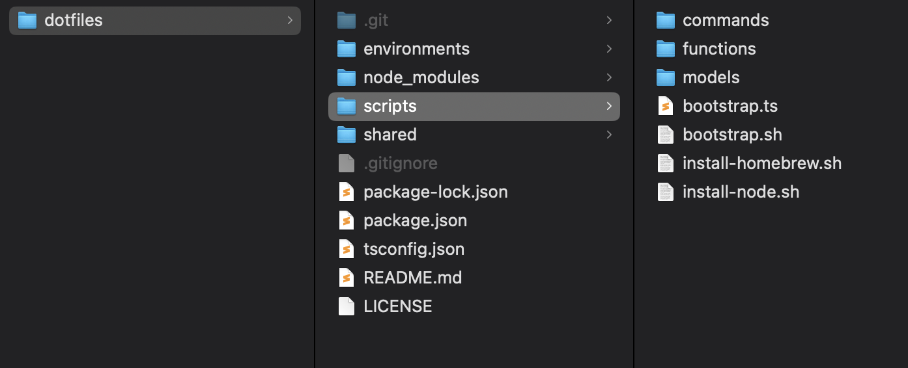

# Git On My Level: Bridging Knowledge with Practical Solutions

If you write code, you're likely using Git. If not, you probably should be—unless you enjoy the thrill of losing track of your work and spending hours hunting down bugs. But don’t worry, this talk isn't about convincing you why Git is a must; there are plenty of resources for that. Instead, we’ll address why many developers feel uneasy about performing complex operations with Git. Although there are numerous resources available to learn Git, I believe a major reason for the unease is the traditional method of teaching—introducing one command or term at a time, often without practical examples of how to use them.

In this session, we’ll bridge that gap. We’ll tackle common Git challenges, dive into practical solutions, and dissect the mechanics behind each approach. You'll learn the pros and cons of different strategies and gain actionable insights to resolve frequent issues faced by you and your team during collaboration.

By the end of this session, you'll be equipped with the skills and confidence to handle Git more effectively and improve your development workflow.

## Introduction

Most of this presentation's information was found in sections 1-3 of the [Pro Git book](https://git-scm.com/book/en/v2), its problems come from my career, and its solutions come from past tears I have shed.

## Slides

### 2. Term: Client

The tool you use to interact with Git.

> [!TIP] Sublime Merge
> 

> [!TIP] Git CLI
> 

> [!TIP] VS Code
> 

### 3-4. Command Syntax

> [!NOTE]
>
> - Commands use `<>` to wrap sections of code that you should replace and `[]` to denote optional segments.
> - Shorthand aliases (one "-" instead of "--") require a space instead of an equal sign when they accept values.
> ```
> git log –max-count=<number>
> git log -n <number>
> git log -<number>
> ```
> - Order of arguments is sometimes important. In such cases they are listed in the order they must go in.
> ```
> git diff --staged [<path to file(s)>]
> ```

### 5. Term: Repository

Directory storing all Git information.



### 6. How Do I Create A New Repository?

Command: `git init`

#### Tutorial

```bash
mkdir my-new-site
cd my-new-site
git init
```

<details>
<summary>Output:</summary>

```
~ mkdir my-new-site
my-new-site
~ cd my-new-site
~ git init
Initialized empty Git repository in /Users/deastway/Sites/my-new-site/.git/
```

</details>
