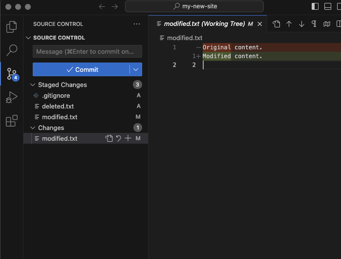
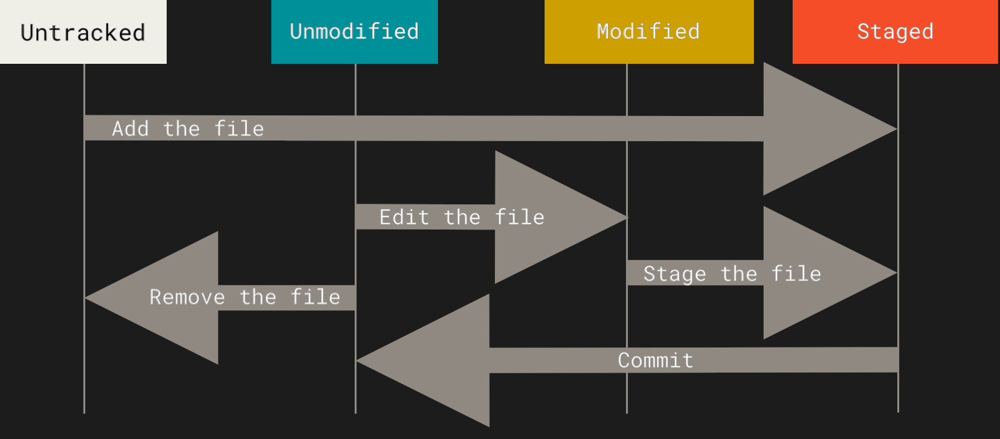
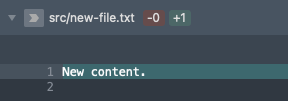
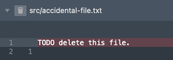

# Git On My Level: Bridging Knowledge with Practical Solutions

## Description

If you write code, you're likely using Git. If not, you probably should be—unless you enjoy the thrill of losing track of your work and spending hours hunting down bugs. But don’t worry, this talk isn't about convincing you why Git is a must; there are plenty of resources for that. Instead, we’ll address why many developers feel uneasy about performing complex operations with Git. Although there are numerous resources available to learn Git, I believe a major reason for the unease is the traditional method of teaching—introducing one command or term at a time, often without practical examples of how to use them.

In this session, we’ll bridge that gap. We’ll tackle common Git challenges, dive into practical solutions, and dissect the mechanics behind each approach. You'll learn the pros and cons of different strategies and gain actionable insights to resolve frequent issues faced by you and your team during collaboration.

By the end of this session, you'll be equipped with the skills and confidence to handle Git more effectively and improve your development workflow.

Most of this presentation's information was found in sections 1-3 of the [Pro Git book](https://git-scm.com/book/en/v2), its problems come from my career, and its solutions come from past tears I have shed.

## Term: Client

The tool you use to interact with Git.

<details>
<summary>Sublime Merge</summary>


</details>

<details>
<summary>Git CLI</summary>


</details>

<details>
<summary>VS Code</summary>



</details>

## Note: Command Syntax

- Commands use `<>` to wrap sections of code that you should replace and `[]` to denote optional segments.
- Shorthand aliases (one "-" instead of "--") require a space instead of an equal sign when they accept values.
```bash
git log –max-count=<number>
git log -n <number>
git log -<number>
```
- Order of arguments is sometimes important. In such cases they are listed in the order they must go in.
```bash
git diff --staged [<path to file(s)>]
```

## Term: Repository

Directory storing all Git information.


## How Do I Create A New Repository?

<details>
<summary>Follow Along</summary>

```bash
mkdir my-new-site
cd my-new-site
git init
```

</details>

```
~ mkdir my-new-site
my-new-site
~ cd my-new-site
~ git init
Initialized empty Git repository in /Users/deastway/Sites/my-new-site/.git/
```

## How Do I Clone An Existing Repository?

Using SSH.

```
~ git clone git@github.com:DustinMEastway/git-on-my-level.git
Cloning into 'git-on-my-level'...
remote: Enumerating objects: 184, done.
remote: Counting objects: 100% (126/126), done.
remote: Compressing objects: 100% (91/91), done.
remote: Total 184 (delta 67), reused 90 (delta 35), pack-reused 58 (from 1)
Receiving objects: 100% (184/184), 1.72 MiB | 7.93 MiB/s, done.
Resolving deltas: 100% (90/90), done.
```

## How Do I Clone An Existing Repository?

Using HTTPS.

```
~ git clone https://github.com/DustinMEastway/git-on-my-level.git
Cloning into 'git-on-my-level'...
remote: Enumerating objects: 184, done.
remote: Counting objects: 100% (126/126), done.
remote: Compressing objects: 100% (91/91), done.
remote: Total 184 (delta 67), reused 90 (delta 35), pack-reused 58 (from 1)
Receiving objects: 100% (184/184), 1.72 MiB | 10.06 MiB/s, done.
Resolving deltas: 100% (90/90), done.
```

## How Do I Get The Repository’s Status?

<details>
<summary>Follow Along</summary>

```bash
git status
```

</details>

```
~ git status
On branch master

No commits yet

nothing to commit (create/copy files and use "git add" to track)
```

```
~ git status
On branch main
Your branch is up to date with 'origin/main'.

nothing to commit, working tree clean
```

## Note: Four States Of Files



## How Do I Get The Repository’s Status?

<details>
<summary>Follow Along</summary>

```bash
mkdir src
echo "TODO delete this file." > src/accidental-file.txt
echo "TODO modify this content." > src/modify.md
echo " Content to rename." > old-config.txt
git status
```

</details>

```
~ mkdir src
src
~ echo "TODO delete this file." > src/accidental-file.txt
~ echo "TODO modify this content." > src/modify.md
~ echo " Content to rename." > old-config.txt
~ git status
On branch master

No commits yet

Untracked files:
  (use "git add <file>..." to include in what will be committed)
  old-config.txt
  src/

nothing added to commit but untracked files present (use "git add" to track)
```

## How Do I Add Files To A Repository?

File path(s).

<details>
<summary>Follow Along</summary>

```bash
git add old-config.txt src/accidental-file.txt
git status
```

</details>

```
~ git add old-config.txt src/accidental-file.txt
~ git status
On branch master

No commits yet

Changes to be committed:
  (use "git rm --cached <file>..." to unstage)
  new file:   old-config.txt
  new file:   src/accidental-file.txt

Untracked files:
  (use "git add <file>..." to include in what will be committed)
  src/modify.md
```

## Note: File(s) Command Arguments

Pathspec - directory/file path, pattern, etc.

Accept one or more of the following separated by spaces.
- Directory path.
  - Example: `src/` matches all files in the "src" subdirectory.
- File path.
  - Example: `src/accidental-file.txt` matches "accidental-file.txt" in "src".
- Pattern.
  - Example: `*.txt` matches all ".txt" files.
  - Example: `src/*.txt` matches all ".txt" files in the "src" directory.

## How Do I Add Files To A Repository?

Directory path(s).

<details>
<summary>Follow Along</summary>

```bash
git add src
git status
```

</details>

```
~ git add src
~ git status
On branch master

No commits yet

Changes to be committed:
  (use "git rm --cached <file>..." to unstage)
  new file:   old-config.txt
  new file:   src/accidental-file.txt
  new file:   src/modify.md
```

## How Do I Ignore Files?

Untracked files in `.gitignore`.

```
~ git status
On branch master

No commits yet

Changes to be committed:
  (use "git rm --cached <file>..." to unstage)
  new file:   old-config.txt
  new file:   src/accidental-file.txt
  new file:   src/modify.md

Untracked files:
  (use "git add <file>..." to include in what will be committed)
  .DS_Store
  src/.DS_Store
```

## How Do I Ignore Files?

Untracked files in `.gitignore`.

<details>
<summary>Follow Along</summary>

```bash
echo ".DS_Store" > .gitignore
git status
git add .gitignore
```

</details>

```
~ echo ".DS_Store" > .gitignore
~ git status
On branch master

No commits yet

Changes to be committed:
  (use "git rm --cached <file>..." to unstage)
  new file:   old-config.txt
  new file:   src/accidental-file.txt
  new file:   src/modify.md

Untracked files:
  (use "git add <file>..." to include in what will be committed)
  .gitignore

~ git add .gitignore
```

## Note: Commonly Ignored Files

- Dependencies (e.g. “node_modules”).
- Compiled output (e.g. “dist”, “build”, etc.).
- Files with secrets (e.g. “.env”).
- Personal IDE configurations (e.g. “.vscode”).

## How Do I Display Changes?

Staged changes.

<details>
<summary>Follow Along</summary>

```bash
git diff --staged
```

</details>

```
~ git diff --staged
diff --git a/.gitignore b/.gitignore
new file mode 100644
index 0000000..e43b0f9
--- /dev/null
+++ b/.gitignore
@@ -0,0 +1 @@
+.DS_Store
diff --git a/old-config.txt b/old-config.txt
new file mode 100644
index 0000000..213fa47
--- /dev/null
+++ b/old-config.txt
@@ -0,0 +1 @@
+ Content to rename.
diff --git a/src/accidental-file.txt b/src/accidental-file.txt
new file mode 100644
index 0000000..75cf8c6
--- /dev/null
+++ b/src/accidental-file.txt
@@ -0,0 +1 @@
+TODO delete this file.
diff --git a/src/modify.md b/src/modify.md
new file mode 100644
index 0000000..d026723
--- /dev/null
+++ b/src/modify.md
@@ -0,0 +1 @@
+TODO modify this content.
```

## How Do I Display Changes?

A file's staged changes.

<details>
<summary>Follow Along</summary>

```bash
git diff --staged src/modify.md
```

</details>

```
~ git diff --staged src/modify.md
diff --git a/src/modify.md b/src/modify.md
new file mode 100644
index 0000000..d026723
--- /dev/null
+++ b/src/modify.md
@@ -0,0 +1 @@
+TODO modify this content.
```

## Note: Modifying A Staged File

<details>
<summary>Follow Along</summary>

```bash
echo "Modified content." > src/modify.md
git status
```

</details>

```
~ echo "Modified content." > src/modify.md
~ git status
On branch master

No commits yet

Changes to be committed:
  (use "git rm --cached <file>..." to unstage)
  new file:   .gitignore
  new file:   old-config.txt
  new file:   src/accidental-file.txt
  new file:   src/modify.md

Changes not staged for commit:
  (use "git add <file>..." to update what will be committed)
  (use "git restore <file>..." to discard changes in working directory)
  modified:   src/modify.md
```

## How Do I Display Changes?

Unstaged changes.

<details>
<summary>Follow Along</summary>

```bash
git diff src/modify.md
```

</details>

```
~ git diff src/modify.md
diff --git a/src/modify.md b/src/modify.md
index d026723..acd49db 100644
--- a/src/modify.md
+++ b/src/modify.md
@@ -1 +1 @@
-TODO modify this content.
+Modified content.
```

## Term: Change

<details>
<summary>Add a file.</summary>



</details>

<details>
<summary>Delete a file.</summary>



</details>

<details>
<summary>Edit lines.</summary>


</details>

<details>
<summary>Move/rename a file.</summary>


</details>